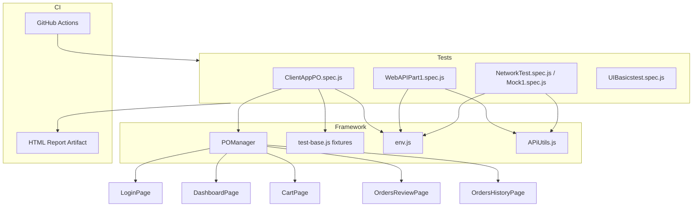

# Playwright Test Automation Portfolio

End-to-end and API test automation framework built with **Playwright**, **Page Object Model**, and **CI/CD** integration. Covers UI flows, API seeding, network mocking, file upload/download, and data-driven testing against [Rahul Shetty Academy](https://rahulshettyacademy.com) demo applications.

## Highlights

- Page Object Model with centralized `POManager`
- Custom Playwright fixtures for reusable test data
- API helpers for token auth and order creation
- Network interception / response mocking
- Environment-based credentials (no secrets in source)
- GitHub Actions CI with HTML report artifacts
- Tagged tests for selective execution (`@Smoke`, `@Web`, `@API`)

## Architecture



## Project structure

```
├── pageobjects/          # Page Object Model (JavaScript)
├── pageobjects_ts/       # TypeScript POM mirror
├── utils/
│   ├── env.js            # Credential & config loader
│   ├── test-base.js      # Custom Playwright fixtures
│   ├── APiUtils.js       # API login + order helpers
│   └── placeorderTestData.json
├── tests/                # Spec files
├── .github/workflows/    # CI pipeline
├── playwright.config.js
└── .env.example
```

## Quick start

### 1. Install dependencies

```bash
npm install
npx playwright install chromium
```

### 2. Configure credentials

```bash
cp .env.example .env
```

Edit `.env` with your Rahul Shetty Academy credentials:

| Variable | Used for |
|----------|----------|
| `CLIENT_APP_EMAIL` | Client app login |
| `CLIENT_APP_PASSWORD` | Client app login |
| `PRODUCT_ORDERED_ID` | API order creation |
| `ORDER_PRODUCT_NAME` | E2E product selection |
| `EVENTHUB_EMAIL` | EventHub mocking tests |
| `EVENTHUB_PASSWORD` | EventHub mocking tests |

### 3. Run tests

```bash
# Full suite
npm test

# Flagship smoke tests (recommended for demos)
npm run test:smoke

# UI-only practice tests (no .env required)
npm run test:web

# API + network tests
npm run test:api

# Open last HTML report
npm run report
```

## Test suites

| Tag | File | What it proves |
|-----|------|----------------|
| `@Smoke @Web` | `ClientAppPO.spec.js` | Full E2E order flow via POM |
| `@Smoke @API` | `WebAPIPart1.spec.js` | API creates order, UI verifies it |
| `@API` | `NetworkTest.spec.js` | Mock empty orders API response |
| `@API` | `Mock1.spec.js` | EventHub API mocking + UI assertions |
| `@Web` | `upload-download.spec.js` | Excel download, edit, upload |
| `@Web` | `UIBasicstest.spec.js` | Browser context, controls, child windows |
| `@Web` | `MoreValidations.spec.js` | Popups, frames, screenshots |

Tests that require credentials **skip gracefully** when `.env` is not configured, so public `@Web` tests still run in CI.

## CI/CD

GitHub Actions runs on every push/PR to `main`:

1. Installs dependencies and Chromium
2. Runs the full Playwright suite
3. Uploads `playwright-report/` and `test-results/` as artifacts

### Required GitHub Secrets

Add these under **Settings → Secrets and variables → Actions**:

- `CLIENT_APP_EMAIL`
- `CLIENT_APP_PASSWORD`
- `PRODUCT_ORDERED_ID`
- `ORDER_PRODUCT_NAME` (optional)
- `EVENTHUB_EMAIL`
- `EVENTHUB_PASSWORD`

Without secrets, credential-dependent tests skip; public practice-site tests still pass.

## Design decisions (interview talking points)

**Why Page Object Model?**  
Keeps locators and page actions in one place. When the UI changes, you update one file — not every test.

**Why API + UI hybrid?**  
`beforeAll` creates an order via API (fast, reliable setup), then UI tests verify what the user actually sees.

**Why `page.route()` mocking?**  
Tests edge cases (empty orders, 6 vs 4 events) without depending on live backend state.

**Why environment variables?**  
Credentials never belong in source control. Same tests run locally and in CI with different configs.

## Tech stack

- Playwright 1.59+
- JavaScript (+ TypeScript page objects)
- ExcelJS for file handling
- dotenv for local config
- GitHub Actions for CI

## Author

Chinmaya Karthik Botta — QA Automation / SDET portfolio project.
